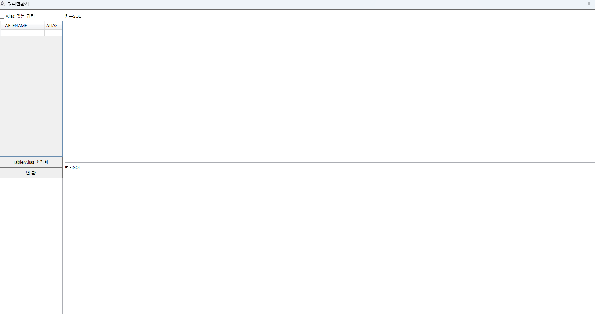

오전 전날 못했던 개발환경 구축 마무리 및 DB 개발 툴 설치 (Golden6, PLEdit, 개발자도우미)
 - 공유 폴더 접속 문제 해결
 - DB 접속 
 - 개발자도우미로 DB 테이블, 컬럼 확인(오라클 딕셔너리)

## 개발환경 세팅 / 원무보험팀 공유폴더 
```
- 보라매 si 개발환경 세팅 
\\bcdevfile.brmh.org\


- 원무보험팀 공유폴더 
\\100.5.1.186
```


## 보라매 SI 배포시간
```
※ 보라매 SI 배포시간
DEV 09:00 ~ 22:00 매시간 정시 /개발기
STG 08:00. 12:30, 17:30, 20:30 /스태이징
PRD 12:50, 17:50, 20:50 /운영기
```


## DATEWARE
1. 데이터표준 -> 표준데이터조회 : 논리명, 물리명, 의미 파악 
   
   janginsu, / Ezcare12#  

2. ETL데이터 전환  

   매핑정보다운로드 

        주제영역: 원무
        필터조건: 테이블/ ASIS테이블
        컬럼매핑: TOBE/ASIS 컬럼 비교
        SQL SCRIPT: 최종전환스크립트 확인 가능 
 

 ## 쿼리변환기


    
    ASIS 쿼리문 TOBE로 변환하는 TOOL 
    ALIAS, TABLENAME 입력후 변환 

 ```
asis와 tobe의 테이블명과 컬럼명이 다른경우 
"매핑정의서 / 매핑일정관리"로 확인가능
개발관리 - 솔루션구축 - 마이그레이션 - 원무보험 -매핑일정관리/  매핑정의서 - 심사관리 or 심사결과관리 
매핑정의서에서 변경된 테이블 및 컬럼 확인가능 

그래도 없다 ? 

개발자 도우미에서 컬럼명 확인, EQS에서 테이블명으로 검색 후 연결고리 찾기, 
    
    asis에 있는 select 절을 하나씩 가져와
	golden에 복붙하고 매핑정의서를 확인하여 변경된 테이블이나 컬럼명 파악하고 수정
	하면 조회가능하다...
```
## 비주얼에서 ASIS 코드 확인하는 법

    인터넷 익스플로러 로그인
    TTBIL
    1234

    로컬 파일열기 
    솔루션 검색 CREATEALLMISU.ASPX
> asis 조회

    ASPX 파일 코드 -> 나누기 -> 이벤트 기능 BTN_OOO_ON 함수 코드 
	-> sQuery에 담겨져있는 값 찾기
	
    프로젝트 새로 열고 
    -> C+S+F -> sQuery 값 검색 
    -> commandtext 값 확인 후 ex) pkg_bil_aid711
    -> commandtext 값 확인 후 ex) pkg_bil_aid711

    PLEdit
    -> C+D 
    %commandtext% 검색 
    body-> 프로시저로 기능 정의 되어있는 부분 

    -> C+F 
    pkg_bil_aid711 안에 pc_sel_aireqbat_k12_pt 검색 


## asis 보험보호미수관리

>접수번호 search 버튼 클릭시 조회된 데이터 없다는 팝업

> 진료년월 입력시 조회 시작 함수 -> btnacptno_onclick -> 패키지 pkg_bil_aid710
		pc_sel_aireqbat_k02 == 접수번호로 청구번호, 심사차수 구하기 

> aif0201t a ,aif0202t b, aireqrqt c 테이블 조합

> 진료비심사결과통보서0201 진료비심사결과통보서0202 진료비청구서내역

```SQL
  where  a.acpt_no            = c.acpt_no(+)
  --and  d.dmd_no             = c.dmd_no
    and  a.sr_num             = b.sr_num(+)
    and  a.acpt_no            = in_acpt_no
    and  a.dmd_no             = decode(in_dmd_no, '' , a.dmd_no, in_dmd_no)
```
```SQL
 aif0601t a, aif0602t, b aireqrqt c 테이블 조합 
 의료보호진료비심사결과통보서0601 진료비심사결과통보서0602 진료비청구서내역
     where  a.acpt_no         = c.acpt_no(+)
             --and  d.dmd_no          = c.dmd_no
             and  a.sr_num          = b.sr_num(+)
             and  a.acpt_no         = in_acpt_no
             and  a.dmd_no          = decode(in_dmd_no, '' , a.dmd_no, in_dmd_no)
```
```SQL
 aif0801t a, aif0802t b , aireqrqt c  테이블 조합 
 원외처방약제비심사결과추가통보서0801  원외처방약제비심사결과추가통보서0802 진료비청구서내역
	where  a.acpt_no          = c.acpt_no(+)
             and  a.resr_num         = b.resr_num(+)
             and  a.acpt_no          = in_acpt_no
             and  a.dmd_no           = decode(in_dmd_no, '' , a.dmd_no, in_dmd_no)
```

```
> ftb_cccodest_nm('34U', CSOUT_FLAG, 'N') CSOUT_FLAG	
FTB => 
PLEDIT 함수 찾기 :> 함수안에 있는 SELECT 절을 가져와 서브쿼리로 실행  
(select COMN_CD_NM
   from CCCCCSTE
  where COMN_GRP_CD = upper('34U')  34W / p
    and COMN_CD    = upper(CSOUT_FLAG))CSOUT_FLAG
	
CCCCCSTE = > TOBE 공통그룹코드 
```
```
select 
접수번호,진료형태, 진료년월, 청구구분, 보험자구분,
진료분야, 발송순번, 접수일자, 심사차수, 묶음번호, 
통보일자, 지급차수, 지급의뢰일자, 청구번호, 심결건수
```


# eqs 
```
PARAMETER 값 입력 후 user id: xbil / password: ez123 / data source: bcstg
execute 하면 쿼리 데이터 조회 
SQL ID 생성시 주석 달기  
```

## 디자인 요청
```
디자인 요청 전 
[asis의 모든 화면 캡쳐 후 tobe에 필요하는 화면 xaml 파일 추가하여 체크인] 

디자인 요청 후
[디자인 요청 3~6일 정도 걸리니 그동안 쿼리 작성하기 ]
```

## 공통코드구분[마스터]
```
asis -> cccodelt(대분류)/ cccodest(소분류)
tobe -> cccccste(공통그룹코드상세) 대분류 / cccccltc(공통그룹코드) 소분류
cccccste table 에서 comm_grp_cd ='271' [보험구분] 
cccccste table 에서 comm_grp_cd ='282' [청구구분]
```
- 구분코드 모를 때 
```SQL
select *
	from cccccltc
 where COMN_GRP_CD_NM like '%청구%'
  -- 청구 구분코드가 몇번인지 확인가능.
 ```


- 공통코드조회
```SQL
 -----------------<공통코드조회>----------------------
EXEC :COMN_GRP_CD_NM := '휴진';

SELECT B.COMN_GRP_CD_NM, A.*
  FROM CCCCCSTE A
     , (SELECT COMN_GRP_CD, COMN_GRP_CD_NM
          FROM CCCCCLTC
         WHERE COMN_GRP_CD_NM LIKE '%'||:COMN_GRP_CD_NM||'%') B
 WHERE A.COMN_GRP_CD IN B.COMN_GRP_CD
 ORDER BY A.COMN_GRP_CD, A.SCRN_MRK_SEQ

-----------------<소스코드 조회>----------------------
SELECT *
  FROM EMBUMENT
 WHERE MENU_NM LIKE '%신규환자%'
 ```


