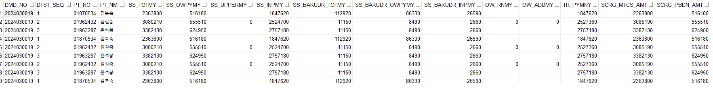
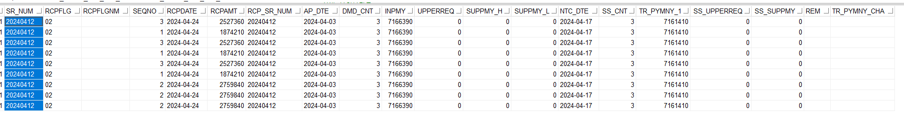

 
## 건강보험미수급관리 페이지 구현 

### PRQS / PBAM 테이블 조인 성공 

**에러 수정**

1. 삭제 버튼 
2. 저장 버튼 [DTST_SEQ 임의값 1로 임시 설정]

<strong style="color:red">강조</strong>

```sql
select *
  from TABLE 
 where ??
```

**상세 조회 sql id**
  HIS.PA.AI.IM.IR.SelUncollectedInAmtDirectorInsDetail_01

- ASIS 조회 접수번호 4114203 로 조회 


4247094 스테이징 접수번호 
- 
  


-------------------------------------------------------


```SQL
AIMIPURD : 보험청구미수수납정보          // DMD_NO, DMD_ACPT_NO, PAY_DT, DTST_SEQ
AIMIPRQS : 청구명세서집계                //  DMD_NO, MED_YM, DMD_ACPT_NO, 
AIMIPBAM : 청구기본서                    // DMD_NO, PT_NO, PT_NM [ 환자정보 ]
AIF0201T : 요양급여비용심사결과통보서1
AIF0204T : 요양급여비용심사결과통보서4 

   -- EX ) RQS와 BAM 조인 조건문  
   AND A.DMD_PACT_TP_CD          = B.DMD_PACT_TP_CD(+)
   AND A.MED_YM                  = B.MED_YM(+)
   AND A.DMD_TP_CD               = B.DMD_TP_CD(+)
   AND A.INS_KND_CD              = B.INS_KND_CD(+)
   AND A.HIRA_MTFL_CD            = decode(B.HIRA_MTFL_CD(+),'00',A.HIRA_MTFL_CD,B.HIRA_MTFL_CD(+))  --자보는 aimipbam 과 aimiprqs가 다름
   AND A.SHIP_SEQ                = B.SHIP_SEQ(+)
   AND A.TRAI_CMP_CD             = Case When B.INS_KND_CD (+) ='6' AND B.TRAI_CMP_CD (+) ='00' Then A.TRAI_CMP_CD ELSE B.TRAI_CMP_CD (+) END -- 자보보험회사통합청구
   AND A.NATCASE_YN              = B.MRT_YN(+)                            -- 2024.04.09 추가

```


```SQL 
-- EQS에 등록된 SQL ID에서 필요한 TABLE 찾는 쿼리
SELECT *
  FROM FXQUERYSTORE
 WHERE 1=1
--   AND UPPER(QUERYID) LIKE UPPER('%' || '.PA.' || '%')
   AND UPPER(QUERYTEXT) LIKE UPPER('%' || 'AIMIPBAM' || '%')
   AND UPPER(QUERYTEXT) LIKE UPPER('%' || 'AIMIPRQS' || '%')
   AND UPPER(QUERYID) NOT LIKE UPPER('B_' || '%')
   AND UPPER(QUERYID) NOT LIKE UPPER('%' || '.GN.' || '%')
--   AND UPPER(CREATEUSERID) LIKE 'PARKDAYEON'
 ORDER BY 1, CREATEDATE DESC
;
```


