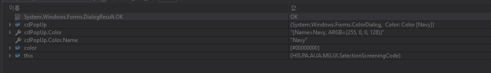

<!--코멘트 조회화면 Hpopup 20170831
        <HPopup Width="1200" Height="700" Placement="Center" Name="hpopup_Comment">-->
        <CONTROL:NonTopmostPopup Name="hpopup_UncollectedAmtDirectorInsDetail"  PopupAnimation="Fade" Width="1200" Height="700" Margin="0" 
                                 Padding="0"   Placement="Center"   AllowsTransparency="True">
            <i:Interaction.Behaviors>
                <BEHAVIOR:MouseDragPopupBehavior  AllowMouseLeaveClose="False"/>
            </i:Interaction.Behaviors>
            <CONTROL:ReSizeGrid TargetControl="NON_TOPMOST_POPUP" Margin="0" Padding="0">

                <Grid Margin="10">
                    <Grid.RowDefinitions>
                        <RowDefinition/>
                        <RowDefinition Height="Auto"/>
                    </Grid.RowDefinitions>
                    <Grid Margin="0,0,0,10">
                        <Grid.RowDefinitions>
                            <RowDefinition Height="Auto"/>
                            <RowDefinition Height="Auto"/>
                            <RowDefinition/>
                        </Grid.RowDefinitions>

                        <Grid Height="30" Margin="0,0,0,5">
                            <StackPanel Orientation="Horizontal">
                                <Border HorizontalAlignment="Left" Style="{StaticResource TitleOneDepthBulletStyle}"/>
                                <HTextBlock TextWrapping="Wrap" Text="상세내역" VerticalAlignment="Center" Foreground="{StaticResource TextHighlightForeground}" Margin="5,0,0,0"/>
                            </StackPanel>
                            <Border Background="{StaticResource OneDepthTitleLineBackground}" VerticalAlignment="Bottom" Height="2"/>
                        </Grid>

                        <HDataGrid x:Name="dgrdDetail"
                               Grid.Row="2" Margin="0,10,0,0"
                               IsEditing="False" LabelClickAction="Nothing" AllowDelete="False" 
                               DataSource="{Binding Path=DTO_UNCOLLECTED_AMT_DIRECTOR_INS_DETAILP_OUT, 
                                                            Mode=TwoWay, UpdateSourceTrigger=PropertyChanged}"  CanUserSelectRowHeader="False">

                            <HDataGrid.FieldSettings>
                                <FieldSettings CellHeight="NaN" />
                            </HDataGrid.FieldSettings>

                            <HDataGrid.FieldLayoutSettings>
                                <FieldLayoutSettings RecordSelectorLocation="None" LabelLocation="SeparateHeader">
                                </FieldLayoutSettings>
                            </HDataGrid.FieldLayoutSettings>

                            <HDataGrid.Fields>
                                <FieldData ColumnIndex="0"  FieldName="DMD_NO"                 FieldLabel="청구번호"                 Width="100" FieldType="Label" CellTextHorizontalAlignment="Center"/>
                                <FieldData ColumnIndex="1"  FieldName="DTST_SEQ"               FieldLabel="명일련"                   Width="100" FieldType="Label" CellTextHorizontalAlignment="Center"/>
                                <FieldData ColumnIndex="2"  FieldName="PT_NO"                  FieldLabel="환자번호"                 Width="100" FieldType="Label" CellTextHorizontalAlignment="Center"/>
                                <FieldData ColumnIndex="3"  FieldName="PT_NM"                  FieldLabel="환자명"                   Width="100" FieldType="Label" CellTextHorizontalAlignment="Center"/>
                                <FieldData ColumnIndex="4"  FieldName="SS_TOTMY"               FieldLabel="(심결)총진료비"           Width="200" FieldType="Double" CellTextHorizontalAlignment="Center"/>
                                <FieldData ColumnIndex="5"  FieldName="SS_OWPYMY"              FieldLabel="(심결)본인부담"           Width="200" FieldType="Double" CellTextHorizontalAlignment="Center"/>
                                <FieldData ColumnIndex="6"  FieldName="SS_UPPERMY"             FieldLabel="(심결)본인부담상한초과"   Width="200" FieldType="Double" CellTextHorizontalAlignment="Center"/>
                                <FieldData ColumnIndex="7"  FieldName="SS_INPMY"               FieldLabel="(심결)보험자부담"         Width="200" FieldType="Double" CellTextHorizontalAlignment="Center"/>
                                <FieldData ColumnIndex="8"  FieldName="SS_BAKUDR_TOTMY"        FieldLabel="(심결)100/100총진료비"    Width="200" FieldType="Double" CellTextHorizontalAlignment="Center"/>
                                <FieldData ColumnIndex="9"  FieldName="SS_BAKUDR_OWPYMY"       FieldLabel="(심결)100/100본인부담"    Width="200" FieldType="Double" CellTextHorizontalAlignment="Center"/>
                                <FieldData ColumnIndex="10" FieldName="SS_BAKUDR_INPMY"        FieldLabel="(심결)100/100보험자부담"  Width="200" FieldType="Double" CellTextHorizontalAlignment="Center"/>
                                <FieldData ColumnIndex="11" FieldName="OW_RNMY"                FieldLabel="본인환급"                 Width="200" FieldType="Double" CellTextHorizontalAlignment="Center"/>
                                <FieldData ColumnIndex="12" FieldName="OW_ADDMY"               FieldLabel="본인추가"                 Width="200" FieldType="Double" CellTextHorizontalAlignment="Center"/>
                                <FieldData ColumnIndex="13" FieldName="TR_PYMNY"               FieldLabel="실지급액"                 Width="200" FieldType="Double" CellTextHorizontalAlignment="Center"/>
                                <FieldData ColumnIndex="14" FieldName="SCRG_MTCS_AMT"          FieldLabel="(청구)총진료비"           Width="200" FieldType="Double" CellTextHorizontalAlignment="Center"/>
                                <FieldData ColumnIndex="15" FieldName="SCRG_PBDN_AMT"          FieldLabel="(청구)본인부담"           Width="200" FieldType="Double" CellTextHorizontalAlignment="Center"/>
                                <FieldData ColumnIndex="16" FieldName="SCRG_PBDN_HGLM_AMT"     FieldLabel="(청구)본인부담상한초과"   Width="200" FieldType="Double" CellTextHorizontalAlignment="Center"/>
                                <FieldData ColumnIndex="17" FieldName="SCRG_ABDN_AMT"          FieldLabel="(청구)보험자부담"         Width="200" FieldType="Double" CellTextHorizontalAlignment="Center"/>
                                <FieldData ColumnIndex="18" FieldName="SCRG_SEPAD_WHL_MED_AMT" FieldLabel="(청구)100/100총진료비"    Width="200" FieldType="Double" CellTextHorizontalAlignment="Center"/>
                                <FieldData ColumnIndex="19" FieldName="SCRG_SEPAD_PBDN_AMT"    FieldLabel="(청구)100/100본인부담"    Width="200" FieldType="Double" CellTextHorizontalAlignment="Center"/>
                                <FieldData ColumnIndex="20" FieldName="SCRG_SEPAD_DMD_AMT"     FieldLabel="(청구)100/100보험자부담"  Width="200" FieldType="Double" CellTextHorizontalAlignment="Center"/>
                            </HDataGrid.Fields>
                        </HDataGrid>
                    </Grid>
                    <Border Style="{StaticResource BoundaryLineHorizontalStyle}" Grid.Row="3" VerticalAlignment="Top" Margin="0,-2,0,0"/>
                    <DockPanel Margin="10,0" LastChildFill="False" Grid.Row="3" Height="30">
                        <HButton ButtonTyped="None" x:Name="btnDetail_Comment" Click="btnDetail_Comment_Click" Content="닫기" ButtonStyleType="Close" DockPanel.Dock="Right" Margin="5,0,0,0"/>
                        <HButton ButtonTyped="None" x:Name="btnExcel_Comment" Click="btnExcel_Comment_Click"
                            Content="엑셀" Style="{StaticResource CommonButtonExcelStyle}" DockPanel.Dock="Right" Margin="5,0,0,0"/>
                    </DockPanel>
                </Grid>

            </CONTROL:ReSizeGrid>
        </CONTROL:NonTopmostPopup>


```
               private void dgrdResult1_MouseDoubleClick(object sender, MouseButtonEventArgs e)
        {
            var oItem = dgrdResult1.SelectedItem;
            if (dgrdResult1.CurrentCell.Column.Header.ToString() == "심사차수" && dgrdResult1.CurrentCell.Column.IsReadOnly == true)
            {
                eventSelectUncollectedAmtDirectorInsDetailP();

                if (model.DTO_UNCOLLECTED_AMT_DIRECTOR_INS_DETAILP_OUT.Count <= 0)
                {
                    hpopup_UncollectedAmtDirectorInsDetail.IsOpen = false;
                    return;
                }

                hpopup_UncollectedAmtDirectorInsDetail.IsOpen = true;
            }
        }
```

 public HSFDTOCollectionBaseObject<SelectUncollectedAmtDirectorInsDetailP_INOUT> SelectUncollectedInAmtDirectorInsDetailP(SelectUncollectedAmtDirectorInsDetailP_INOUT inObj)
        {
            string queryLog = this.WriteQueryLog("HIS.PA.AI.IM.IR.SelUncollectedInAmtDirectorInsDetail_01", inObj.ToDataItem(""), QueryType.QueryStore, CommandType.Text);
            //HIS.PA.AI.IM.IR.SelUncollectedInAmtDirectorInsDetail_02 보류 내역을 조회할수도 있을듯.. 일단 지급내역만 생각하기. 2017.08.31 양윤호
            return this.DacAgent.Fill("HIS.PA.AI.IM.IR.SelUncollectedInAmtDirectorInsDetail_01", inObj, typeof(HSFDTOCollectionBaseObject<SelectUncollectedAmtDirectorInsDetailP_INOUT>)) as HSFDTOCollectionBaseObject<SelectUncollectedAmtDirectorInsDetailP_INOUT>;
        }


        ```
D:\HISSolutions\HIS\Deploy\Client 
core 참조 경로 
```





```
```
- 색상 변환 오류 해결 
System.Windows.Forms.ColorDialog를 사용하여 사용자가 선택한 색상을 16진수 코드값으로 얻으려면 몇 가지 단계를 거쳐야 합니다. 기본적으로 ColorDialog는 .NET Framework의 일부이며, 사용자가 선택한 색상을 Color 객체로 제공합니다. 이 Color 객체에서 16진수 형식의 색상 코드를 얻으려면 다음과 같은 방법을 사용할 수 있습니다:

ColorDialog 사용하여 색상 선택하기:

csharp
코드 복사
System.Windows.Forms.ColorDialog cdPopUp = new System.Windows.Forms.ColorDialog();
if (cdPopUp.ShowDialog() == DialogResult.OK)

    // 사용자가 선택한 색상
    Color selectedColor = cdPopUp.Color;
    
    // selectedColor 객체에서 16진수 형식의 색상 코드 얻기
    string colorHex = $"#{selectedColor.ToArgb():X8}".Substring(2); // ARGB 값을 사용하며, #AARRGGBB 형식에서 앞의 두 글자(#)를 생략하기 위해 Substring을 사용
    
    Console.WriteLine("선택한 색상의 16진수 코드: " + colorHex);

 cdPopUp.ShowDialog()를 호출하여 사용자에게 색상 선택 다이얼로그를 표시합니다.
사용자가 색상을 선택하고 확인을 클릭하면, ColorDialog에서 선택한 색상은 cdPopUp.Color 속성을 통해 Color 객체로 반환됩니다.
Color 객체에서 ToArgb() 메서드를 사용하여 ARGB 값으로 변환한 후, 이를 16진수 문자열로 변환합니다.
"#{selectedColor.ToArgb():X8}"에서 X8은 8자리의 16진수로 변환하라는 의미입니다. 앞의 두 자리는 알파 채널을 나타내며, 여기서는 사용하지 않기 위해 Substring(2)를 사용하여 #을 생략했습니다.
이 방법을 사용하면 ColorDialog를 통해 선택한 색상을 16진수 형식으로 얻을 수 있습니다.
```


```
<base:UserControlBase x:Class="HIS.PA.AI.IM.IM.UI.NDRGCodeAskNew"
             xmlns="http://schemas.microsoft.com/winfx/2006/xaml/presentation"
             xmlns:x="http://schemas.microsoft.com/winfx/2006/xaml"
           xmlns:CONTROL="clr-namespace:HIS.PA.CORE.CONTROL;assembly=HIS.PA.CORE.CONTROL"
            xmlns:BEHAVIOR="clr-namespace:HIS.PA.CORE.BEHAVIOR;assembly=HIS.PA.CORE.BEHAVIOR"           
             xmlns:mc="http://schemas.openxmlformats.org/markup-compatibility/2006" 
             xmlns:d="http://schemas.microsoft.com/expression/blend/2008" 
             xmlns:i="http://schemas.microsoft.com/expression/2010/interactivity"
             xmlns:ei="http://schemas.microsoft.com/expression/2010/interactions"
             xmlns:base="clr-namespace:HIS.UI.Base;assembly=HIS.UI.Base"
             xmlns:baseConverter="clr-namespace:HIS.UI.Utility.Converters;assembly=HIS.UI.Utility"
             xmlns:conv="clr-namespace:HIS.PA.CORE.UI.CONVERTER;assembly=HIS.PA.CORE.UI.CONVERTER"
             xmlns:PresentationOptions="http://schemas.microsoft.com/winfx/2006/xaml/presentation/options"    
             xmlns:HIS_PA_CORE_UI="clr-namespace:HIS.PA.CORE.UI;assembly=HIS.PA.CORE.UI"
             xmlns:igEditors="http://infragistics.com/Editors"
             xmlns:local="clr-namespace:HIS.PA.AI.IM.IM.UI" 
             
             mc:Ignorable="d" 
             d:DesignWidth="1600" d:DesignHeight="700"  DesignWidth="1600" DesignHeight="700" Background="{StaticResource MainNormalBackground}" UseLayoutRounding="True">
    <i:Interaction.Triggers>
        <i:EventTrigger EventName="Loaded">
            <i:InvokeCommandAction Command="{Binding LoadCommand}" CommandParameter="{Binding RelativeSource={RelativeSource FindAncestor, AncestorType={x:Type base:UserControlBase}}}"/>
        </i:EventTrigger>
    </i:Interaction.Triggers>
    <UserControl.DataContext>
        <local:NDRGCodeAskNewData/>
    </UserControl.DataContext>
    <base:UserControlBase.Resources>
        <ResourceDictionary>
            <ResourceDictionary.MergedDictionaries>
                <SharedResourceDictionary SourcePath="/HIS.UI.Design.Themes;component/AIResources.xaml" Source="/HIS.UI.Design.Themes;component/AIResources.xaml"/>
            </ResourceDictionary.MergedDictionaries>
            <conv:DateFormatStringConverter x:Key="FormatConverter"/>
        </ResourceDictionary>
    </base:UserControlBase.Resources>
    <Grid Grid.IsSharedSizeScope="True">
        <Grid.RowDefinitions>
            <RowDefinition Height="*"/>
            <RowDefinition Height="30"/>
        </Grid.RowDefinitions>
        <Grid Margin="10">
            <Grid.RowDefinitions>
                <RowDefinition Height="Auto"/>
                <RowDefinition Height="Auto"/>
                <RowDefinition Height="*"/>
            </Grid.RowDefinitions>
            <Border BorderThickness="0,0,1,1" Height="40" BorderBrush="{StaticResource SearchAreaDarkBorderBrush}" Background="{StaticResource SearchAreaBackground}">
                <Border BorderBrush="{StaticResource SearchAreaLightBorderBrush}" BorderThickness="1,1,0,0">
                    <StackPanel Margin="10,0" Orientation="Horizontal" VerticalAlignment="Center">
                        <Border Style="{StaticResource TitleThreeDepthBulletStyle}"/>
                        <HTextBlock Text="조회기준일자" Foreground="{StaticResource TextHighlightForeground}" Margin="5,0,0,0" VerticalAlignment="Center" TextWrapping="Wrap"/>
                        <HDatePicker VerticalAlignment="Center" HorizontalAlignment="Left" Margin="5,0,0,0" Width="95"
                                    SelectedDate="{Binding Path=SelNdrgCodeAsk_IN.IN_APY_DT, Mode=TwoWay, UpdateSourceTrigger=PropertyChanged, Converter={StaticResource FormatConverter}, ConverterParameter='yyyyMMdd'}"/>
                        <Border Style="{StaticResource TitleThreeDepthBulletStyle}" Margin="30,0,0,0"/>
                        <HTextBlock Foreground="{StaticResource TextHighlightForeground}" Text="검색구분" VerticalAlignment="Center" Margin="5,0,0,0"/>
                        <Border Style="{StaticResource GroupBorderLineStyle}" VerticalAlignment="Center" Margin="5,0,0,0">
                            <StackPanel Orientation="Horizontal" VerticalAlignment="Center" Margin="5,0" >
                                <RadioButtonList ScrollViewer.VerticalScrollBarVisibility="Hidden" VerticalAlignment="Center" ItemMargin="5,0" x:Name="rdoAskType" SelectedIndex="0">
                                    <RadioButtonListItem Content="코드"/>
                                    <RadioButtonListItem Content="명칭" />
                                </RadioButtonList>
                            </StackPanel>
                        </Border>
                        <Border Style="{StaticResource TitleThreeDepthBulletStyle}" Margin="30,0,0,0"/>
                        <HTextBlock Foreground="{StaticResource TextHighlightForeground}" Text="코드" VerticalAlignment="Center" Margin="5,0,0,0"/>
                        <HTextBox Width="100" VerticalAlignment="Center" Margin="5,0,0,0" x:Name="txtCode"/>
                        <!--<Border Style="{StaticResource TitleThreeDepthBulletStyle}" Margin="30,0,0,0"/>
                        <HTextBlock Foreground="{StaticResource TextHighlightForeground}" Text="정책가산" VerticalAlignment="Center" Margin="5,0,0,0"/>
                        <HTextBox Width="50" VerticalAlignment="Center" Margin="5,0,0,0"/>-->
                        <HButton Content="조회" ButtonStyleType="Search" VerticalAlignment="Center" Margin="30,0,0,0" Command="{Binding SearchCommand}"/>
                    </StackPanel>
                </Border>
            </Border>
            <Border Grid.Row="1" Style="{StaticResource OneAreaDarkBorderStyle}" Margin="0,5,0,0">
                <Border Style="{StaticResource OneAreaLightBorderStyle}">
                    <StackPanel Orientation="Horizontal" Margin="10,0" VerticalAlignment="Center">
                        <Border Style="{StaticResource TitleThreeDepthBulletStyle}"/>
                        <HTextBlock Text="적용개시일자" Foreground="{StaticResource TextHighlightForeground}" Margin="5,0,0,0" VerticalAlignment="Center" TextWrapping="Wrap"/>
                        <HDatePicker VerticalAlignment="Center" HorizontalAlignment="Left" Margin="5,0,0,0" Width="95"
                                     SelectedDate="{Binding Path=SelNdrgCodeAskAdjs_OUT[0].APY_STR_DT, Mode=OneWay, Converter={StaticResource FormatConverter}, ConverterParameter='yyyyMMdd'}"/>
                        <Border Style="{StaticResource TitleThreeDepthBulletStyle}" Margin="30,0,0,0"/>
                        <HTextBlock Foreground="{StaticResource TextHighlightForeground}" Text="보험조정계수" VerticalAlignment="Center" Margin="5,0,0,0"/>
                        <HTextBlock Text="외과계" VerticalAlignment="Center" Margin="10,0,0,0"/>
                        <HTextBox Width="50" VerticalAlignment="Center" Margin="5,0,0,0" IsEnabled="false" Text="{Binding Path=INS_ADJS_1, Mode=OneWay}"/>
                        <HTextBlock Text="내과계" VerticalAlignment="Center" Margin="10,0,0,0"/>
                        <HTextBox Width="50" VerticalAlignment="Center" Margin="5,0,0,0" IsEnabled="false" Text="{Binding Path=INS_ADJS_2, Mode=OneWay}"/>
                        <HTextBlock Text="정신과계" VerticalAlignment="Center" Margin="10,0,0,0"/>
                        <HTextBox Width="50" VerticalAlignment="Center" Margin="5,0,0,0" IsEnabled="false" Text="{Binding Path=INS_ADJS_3, Mode=OneWay}"/>
                        <Border Style="{StaticResource TitleThreeDepthBulletStyle}" Margin="30,0,0,0"/>
                        <HTextBlock Foreground="{StaticResource TextHighlightForeground}" Text="급여조정계수" VerticalAlignment="Center" Margin="5,0,0,0"/>
                        <HTextBlock Text="외과계" VerticalAlignment="Center" Margin="10,0,0,0"/>
                        <HTextBox Width="50" VerticalAlignment="Center" Margin="5,0,0,0" IsEnabled="false" Text="{Binding Path=SAL_ADJS_1, Mode=OneWay}"/>
                        <HTextBlock Text="내과계" VerticalAlignment="Center" Margin="10,0,0,0"/>
                        <HTextBox Width="50" VerticalAlignment="Center" Margin="5,0,0,0" IsEnabled="false" Text="{Binding Path=SAL_ADJS_2, Mode=OneWay}"/>
                        <HTextBlock Text="정신과계" VerticalAlignment="Center" Margin="10,0,0,0"/>
                        <HTextBox Width="50" VerticalAlignment="Center" Margin="5,0,0,0" IsEnabled="false" Text="{Binding Path=SAL_ADJS_3, Mode=OneWay}"/>
                    </StackPanel>
                </Border>
            </Border>
            <HDataGridEx Grid.Row="2" Margin="0,10,0,0" x:Name="dgrdNdrgCodeAsk" HeadersVisibility="Column" ItemsSource="{Binding SelNdrgCodeAsk_OUT, Mode=TwoWay, UpdateSourceTrigger=PropertyChanged}"
                          CanUserAddRows="False" CanUserDeleteRows="False" CanUserReorderColumns="False" CanUserSelectRowHeader="False" HasRowHeaderStatus="False" CanUserSortColumns="False"
                          FrozenColumnCount="0" SelectionMode="Single" SelectionUnit="FullRow"
                          MouseDoubleClick="dgrdResult1_MouseDoubleClick">
                <DataGrid.Columns>
                    <HDataGridTextColumn Header="AADRG" Binding="{Binding ADRG_NO}" Width="70" HorizontalAlignment="Center" IsReadOnly="True"/>
                    <HDataGridTextColumn Header="구분" Binding="{Binding AFL_CTG_CD}" Width="70" HorizontalAlignment="Center" IsReadOnly="True"/>
                    <HDataGridTextColumn Header="명칭" Binding="{Binding KOR_DRG_NM}" Width="400" HorizontalAlignment="Center" IsReadOnly="True"/>
                    <HDataGridTextColumn Header="RDRG" Binding="{Binding NDRG_NO}" Width="70" HorizontalAlignment="Center" IsReadOnly="True"/>
                    <HDataGridTextColumn Header="평균입원일" Binding="{Binding NDRG_AVG_ADS_DYS}" Width="80" HorizontalAlignment="Center" IsReadOnly="True"/>
                    <HDataGridTextColumn Header="정상군하한일" Binding="{Binding NDRG_NRML_LWLM_ADS_DYS}" Width="80" HorizontalAlignment="Center" IsReadOnly="True"/>
                    <HDataGridTextColumn Header="정상군상한일" Binding="{Binding NDRG_NRML_HGLM_ADS_DYS}" Width="80" HorizontalAlignment="Center" IsReadOnly="True"/>
                    <HDataGridTextColumn Header="기준점수" Binding="{Binding NDRG_CTRA_SCR, StringFormat={}{0:N2}}" Width="70" HorizontalAlignment="Center" IsReadOnly="True"/>
                    <HDataGridTextColumn Header="기준수가" Binding="{Binding NDRG_CTRA_MIF_AMT, StringFormat={}{0:N0}}" Width="70" HorizontalAlignment="Center" IsReadOnly="True"/>
                    <HDataGridTextColumn Header="일당점수" Binding="{Binding NDRG_DYPY_SCR, StringFormat={}{0:N2}}" Width="70" HorizontalAlignment="Center" IsReadOnly="True"/>
                    <HDataGridTextColumn Header="일당수가" Binding="{Binding NDRG_DYPY_MIF_AMT, StringFormat={}{0:N0}}" Width="70" HorizontalAlignment="Center" IsReadOnly="True"/>
                    <HDataGridTextColumn Header="보험조정계수" Binding="{Binding INS_ADJS_CFCN}" Width="100" HorizontalAlignment="Center" IsReadOnly="True"/>
                    <HDataGridTextColumn Header="급여조정계수" Binding="{Binding SAL_ADJS_CFCN}" Width="100" HorizontalAlignment="Center" IsReadOnly="True"/>
                    <HDataGridTextColumn Header="적용일" Binding="{Binding APY_STR_DT}" Width="100" HorizontalAlignment="Center" IsReadOnly="True"/>
                    <HDataGridTextColumn Header="종료일" Binding="{Binding APY_END_DT}" Width="100" HorizontalAlignment="Center" IsReadOnly="True"/>
                </DataGrid.Columns>
            </HDataGridEx>
        </Grid>
        <Border Background="{StaticResource BoundaryLineNormalBackground}" BorderBrush="{StaticResource BoundaryLineNormalBorderBrush}" BorderThickness="0,0,0,1" Height="2" Grid.Row="1" Margin="0,-2,0,0" VerticalAlignment="Top"/>
        <Border Background="{StaticResource CommonButtonAreaNormalBackground}" Grid.Row="1">
            <DockPanel Margin="10,0" LastChildFill="False">
                <HButton PermissionManager.ButtonPermission="None" Content="닫기" ButtonStyleType="Close" DockPanel.Dock="Right" Command="{Binding CloseCommand}"/>
                <HButton PermissionManager.ButtonPermission="None" Content="엑셀" Style="{StaticResource CommonButtonExcelStyle}" DockPanel.Dock="Right" Margin="0,0,5,0" Command="{Binding ExcelCommand}"/>
            </DockPanel>
        </Border>
        <!--코멘트 조회화면 Hpopup 20170831
        <HPopup Width="1200" Height="700" Placement="Center" Name="hpopup_Comment">-->
        <CONTROL:NonTopmostPopup Name="hpopup_UncollectedAmtDirectorInsDetail"  PopupAnimation="Fade" Width="1200" Height="750" Margin="0" 
                                 Padding="0"   Placement="Center"   AllowsTransparency="True">
            <i:Interaction.Behaviors>
                <BEHAVIOR:MouseDragPopupBehavior  AllowMouseLeaveClose="False"/>
            </i:Interaction.Behaviors>
            <CONTROL:ReSizeGrid TargetControl="NON_TOPMOST_POPUP" Margin="0" Padding="0">

                <Grid Margin="10">
                    <Grid.RowDefinitions>
                        <RowDefinition/>
                        <RowDefinition Height="Auto"/>
                    </Grid.RowDefinitions>
                    <Grid Margin="0,0,0,10">
                        <Grid.RowDefinitions>
                            <RowDefinition Height="Auto"/>
                            <RowDefinition Height="Auto"/>
                            <RowDefinition/>
                        </Grid.RowDefinitions>

                        <Grid Height="30" Margin="0,0,0,5">
                            <StackPanel Orientation="Horizontal">
                                <Border HorizontalAlignment="Left" Style="{StaticResource TitleOneDepthBulletStyle}"/>
                                <HTextBlock TextWrapping="Wrap" Text="상세내역" VerticalAlignment="Center" Foreground="{StaticResource TextHighlightForeground}" Margin="5,0,0,0"/>
                            </StackPanel>
                            <Border Background="{StaticResource OneDepthTitleLineBackground}" VerticalAlignment="Bottom" Height="2"/>
                        </Grid>

                        <HDataGrid x:Name="dgrdDetail"
                               Grid.Row="2" Margin="0,10,0,0"
                               IsEditing="False" LabelClickAction="Nothing" AllowDelete="False" 
                               DataSource="{Binding Path=DTO_UNCOLLECTED_AMT_DIRECTOR_INS_DETAILP_OUT, 
                                                            Mode=TwoWay, UpdateSourceTrigger=PropertyChanged}"  CanUserSelectRowHeader="False">

                            <HDataGrid.FieldSettings>
                                <FieldSettings CellHeight="NaN" />
                            </HDataGrid.FieldSettings>

                            <HDataGrid.FieldLayoutSettings>
                                <FieldLayoutSettings RecordSelectorLocation="None" LabelLocation="SeparateHeader">
                                </FieldLayoutSettings>
                            </HDataGrid.FieldLayoutSettings>

                            <HDataGrid.Fields>
                                <FieldData ColumnIndex="0"  FieldName="DMD_NO"                 FieldLabel="청구번호"                 Width="100" FieldType="Label" CellTextHorizontalAlignment="Center"/>
                                <FieldData ColumnIndex="1"  FieldName="DTST_SEQ"               FieldLabel="명일련"                   Width="100" FieldType="Label" CellTextHorizontalAlignment="Center"/>
                                <FieldData ColumnIndex="2"  FieldName="PT_NO"                  FieldLabel="환자번호"                 Width="100" FieldType="Label" CellTextHorizontalAlignment="Center"/>
                                <FieldData ColumnIndex="3"  FieldName="PT_NM"                  FieldLabel="환자명"                   Width="100" FieldType="Label" CellTextHorizontalAlignment="Center"/>
                                <FieldData ColumnIndex="4"  FieldName="SS_TOTMY"               FieldLabel="(심결)총진료비"           Width="200" FieldType="Double" CellTextHorizontalAlignment="Center"/>
                                <FieldData ColumnIndex="5"  FieldName="SS_OWPYMY"              FieldLabel="(심결)본인부담"           Width="200" FieldType="Double" CellTextHorizontalAlignment="Center"/>
                                <FieldData ColumnIndex="6"  FieldName="SS_UPPERMY"             FieldLabel="(심결)본인부담상한초과"   Width="200" FieldType="Double" CellTextHorizontalAlignment="Center"/>
                                <FieldData ColumnIndex="7"  FieldName="SS_INPMY"               FieldLabel="(심결)보험자부담"         Width="200" FieldType="Double" CellTextHorizontalAlignment="Center"/>
                                <FieldData ColumnIndex="8"  FieldName="SS_BAKUDR_TOTMY"        FieldLabel="(심결)100/100총진료비"    Width="200" FieldType="Double" CellTextHorizontalAlignment="Center"/>
                                <FieldData ColumnIndex="9"  FieldName="SS_BAKUDR_OWPYMY"       FieldLabel="(심결)100/100본인부담"    Width="200" FieldType="Double" CellTextHorizontalAlignment="Center"/>
                                <FieldData ColumnIndex="10" FieldName="SS_BAKUDR_INPMY"        FieldLabel="(심결)100/100보험자부담"  Width="200" FieldType="Double" CellTextHorizontalAlignment="Center"/>
                                <FieldData ColumnIndex="11" FieldName="OW_RNMY"                FieldLabel="본인환급"                 Width="200" FieldType="Double" CellTextHorizontalAlignment="Center"/>
                                <FieldData ColumnIndex="12" FieldName="OW_ADDMY"               FieldLabel="본인추가"                 Width="200" FieldType="Double" CellTextHorizontalAlignment="Center"/>
                                <FieldData ColumnIndex="13" FieldName="TR_PYMNY"               FieldLabel="실지급액"                 Width="200" FieldType="Double" CellTextHorizontalAlignment="Center"/>
                                <FieldData ColumnIndex="14" FieldName="SCRG_MTCS_AMT"          FieldLabel="(청구)총진료비"           Width="200" FieldType="Double" CellTextHorizontalAlignment="Center"/>
                                <FieldData ColumnIndex="15" FieldName="SCRG_PBDN_AMT"          FieldLabel="(청구)본인부담"           Width="200" FieldType="Double" CellTextHorizontalAlignment="Center"/>
                                <FieldData ColumnIndex="16" FieldName="SCRG_PBDN_HGLM_AMT"     FieldLabel="(청구)본인부담상한초과"   Width="200" FieldType="Double" CellTextHorizontalAlignment="Center"/>
                                <FieldData ColumnIndex="17" FieldName="SCRG_ABDN_AMT"          FieldLabel="(청구)보험자부담"         Width="200" FieldType="Double" CellTextHorizontalAlignment="Center"/>
                                <FieldData ColumnIndex="18" FieldName="SCRG_SEPAD_WHL_MED_AMT" FieldLabel="(청구)100/100총진료비"    Width="200" FieldType="Double" CellTextHorizontalAlignment="Center"/>
                                <FieldData ColumnIndex="19" FieldName="SCRG_SEPAD_PBDN_AMT"    FieldLabel="(청구)100/100본인부담"    Width="200" FieldType="Double" CellTextHorizontalAlignment="Center"/>
                                <FieldData ColumnIndex="20" FieldName="SCRG_SEPAD_DMD_AMT"     FieldLabel="(청구)100/100보험자부담"  Width="200" FieldType="Double" CellTextHorizontalAlignment="Center"/>
                            </HDataGrid.Fields>
                        </HDataGrid>
                    </Grid>
                    <Border Style="{StaticResource BoundaryLineHorizontalStyle}" Grid.Row="3" VerticalAlignment="Top" Margin="0,-2,0,0"/>
                    <DockPanel Margin="10,0" LastChildFill="False" Grid.Row="3" Height="30">
                        <HButton ButtonTyped="None" x:Name="btnDetail_Comment" Click="btnDetail_Comment_Click" Content="닫기" ButtonStyleType="Close" DockPanel.Dock="Right" Margin="5,0,0,0"/>
                        <HButton ButtonTyped="None" x:Name="btnExcel_Comment" Click="btnExcel_Comment_Click"
                            Content="엑셀" Style="{StaticResource CommonButtonExcelStyle}" DockPanel.Dock="Right" Margin="5,0,0,0"/>
                    </DockPanel>
                </Grid>

            </CONTROL:ReSizeGrid>
        </CONTROL:NonTopmostPopup>

    </Grid>
</base:UserControlBase>
    
    
```

```
내일 와서 할일 
- 신규화면 이름 정하고 디자인 요청서 작성 후 신청 하기
- sql id = HIS.PA.AI.IM.IM.NdrgCodeDayAsk_Select

```