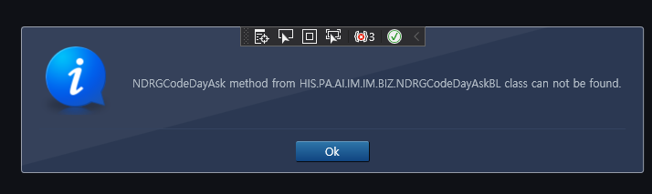
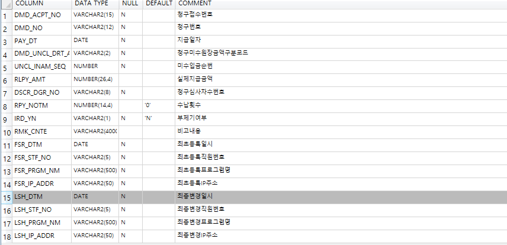
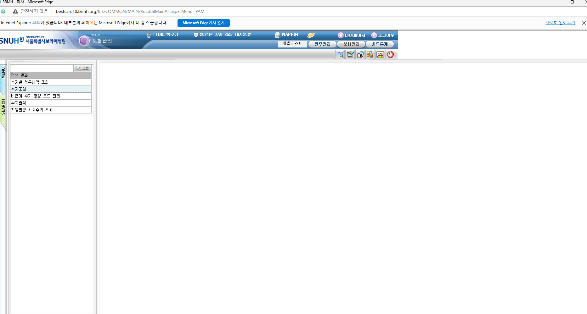
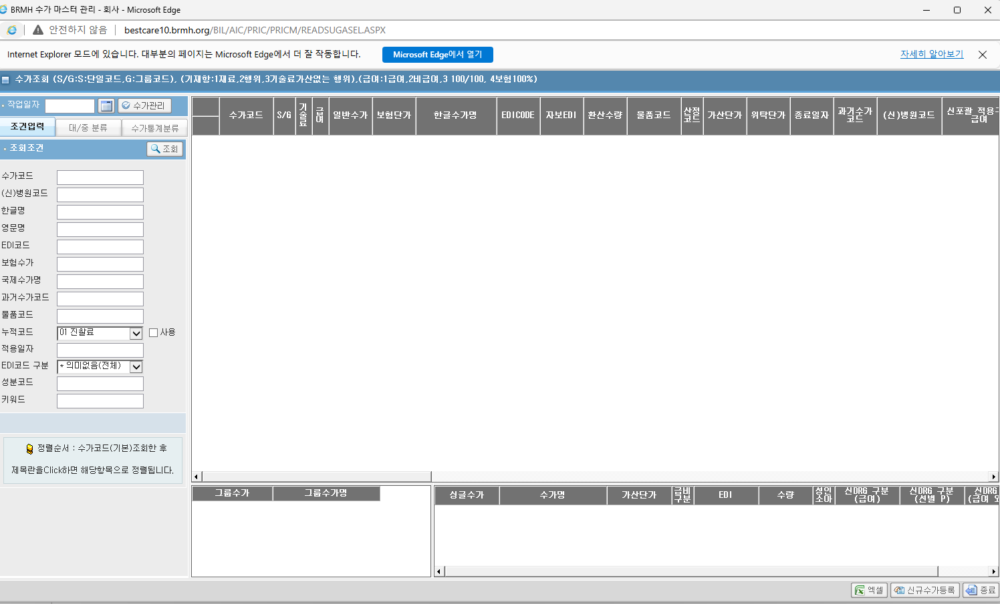
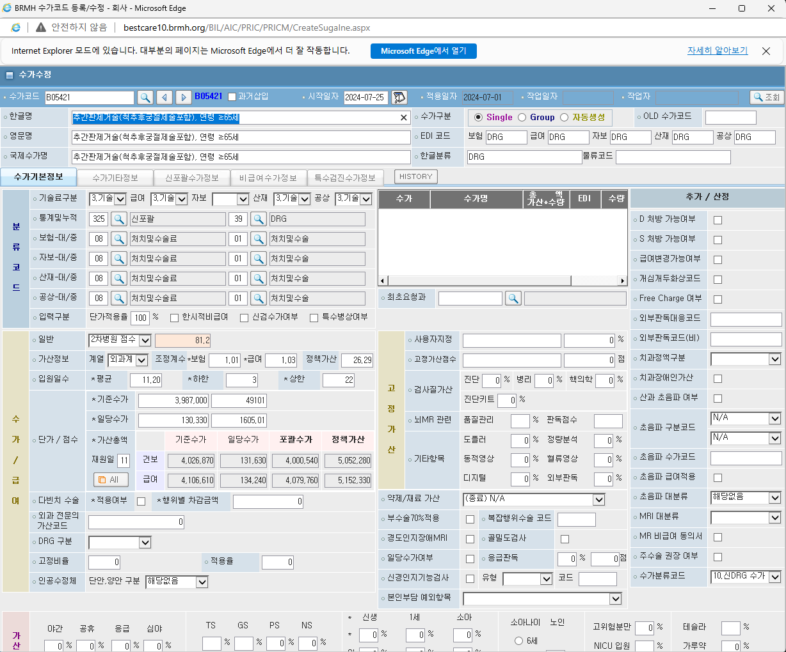
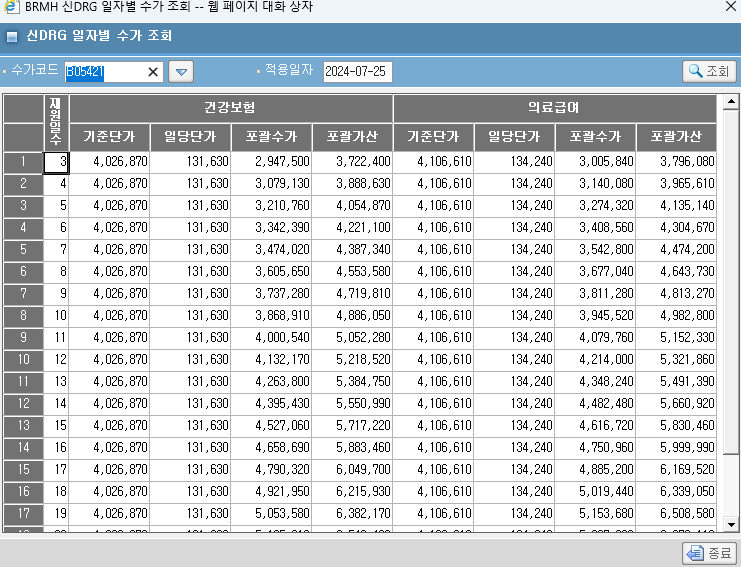

 # 신포괄번호요일별조회 화면 구현 
 - 디자인 요청 
    - NDRGCodeDayAsk.xaml

- DTO, BIZ, DAC 연결

- SQL ID = HIS.PA.AI.IM.IM.NdrgCodeDayAsk_Select

- INPUT : NDRGNO, MEDYM


]


# 건강보험미수관리 

**저장버튼 클릭 EQS**
- SQLID : HIS.PA.AI.IM.IR.InsUncollectedInAmtDirectorInsSalaryMngP

```SQL 
 INSERT /* HIS.PA.IM.IR.InsUncollectedInAmtDirectorInsSalaryMngP */
    INTO AIMIPURD
        (
           DMD_ACPT_NO 
        ,  DMD_NO
        ,  UNCL_INAM_SEQ  
        ,  DMD_UNCL_DRT_AMT_TP_CD 
        ,  PAY_DT
        ,  RLPY_AMT 
        ,  DSCR_DGR_NO
        ,  RMK_CNTE    
        ,  IRD_YN 
                       , FSR_DTM                                 -- 30.
                       , FSR_IP_ADDR                             -- 31.
                       , FSR_PRGM_NM                             -- 32.
                       , FSR_STF_NO                              -- 29.
                       , LSH_DTM                                 -- 34.
                       , LSH_IP_ADDR                             -- 35.
                       , LSH_PRGM_NM                             -- 36.    
                       , LSH_STF_NO                              -- 33.   
       				   , DTST_SEQ
        )
   SELECT  :IN_DMD_ACPT_NO 
        ,  :IN_DMD_NO
        ,  NVL(MAX(UNCL_INAM_SEQ), 0) + 1
        ,  :IN_RCPFLG 
        ,  TO_DATE(:IN_RCPDATE ,'YYYY-MM-DD')
        ,  NVL(:IN_RCPAMT ,0)
        ,  :IN_SR_NUM 
        ,  :IN_REM 
        ,  'N'
                       , SYSDATE                                 -- 30.
                       , :HIS_IP_ADDR                            -- 31.
                       , :HIS_PRGM_NM                            -- 32.
                       , :HIS_STF_NO                             -- 33.
                       , SYSDATE                                 -- 34.
                       , :HIS_IP_ADDR                            -- 35.
                       , :HIS_PRGM_NM                            -- 36.
                       , :HIS_STF_NO                             -- 33.
                       , 1
     FROM  AHMIPURD
    WHERE  DMD_ACPT_NO(+) = :IN_DMD_ACPT_NO 
       AND  DMD_NO(+) = :IN_DMD_NO

```



NDRGCodeDayAsk_IN

ndrgcodedayask_in


asis 화면 



-> 수가조회 



-> 수가관리



-> All




내일 화면 디자인 구현 